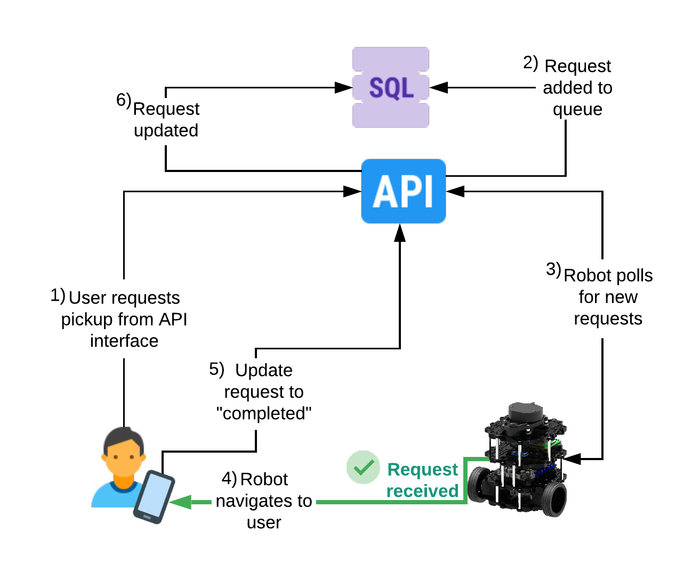
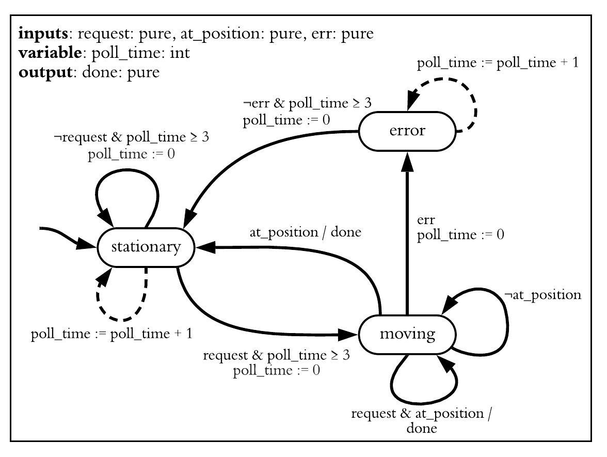
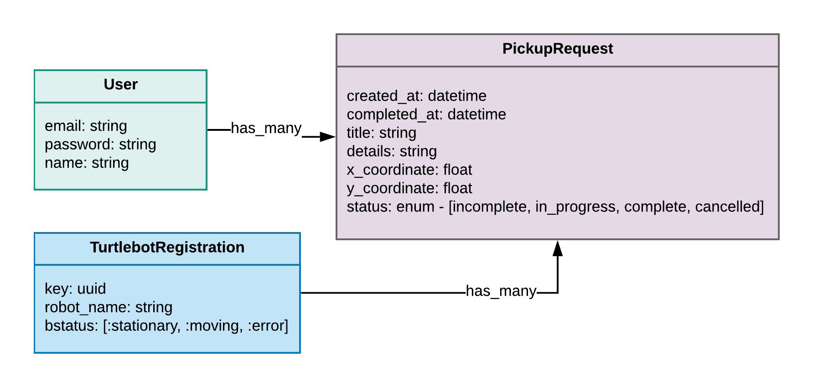
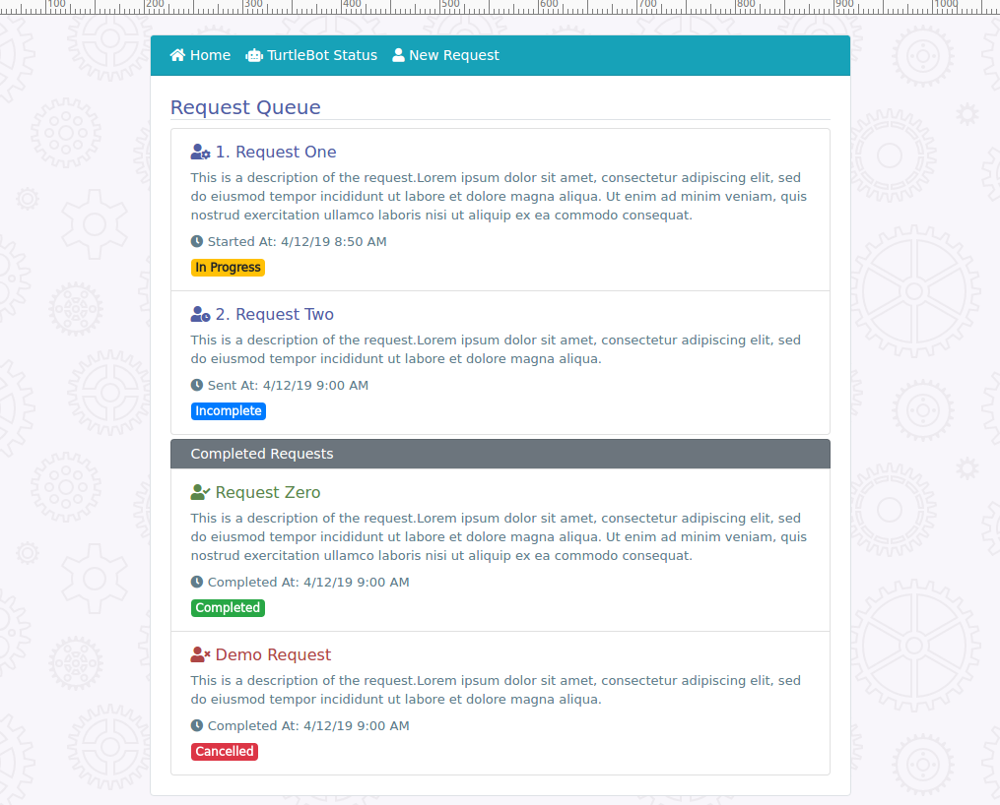
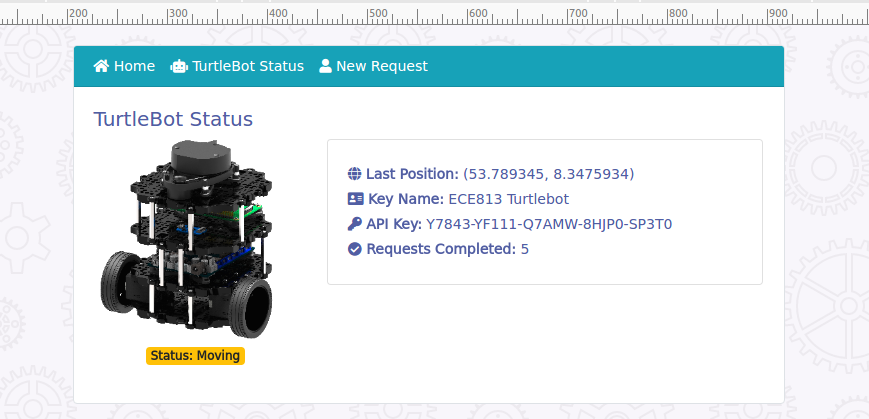

# Turtlebot Taxi Service Request Server

[Heroku Application](https://msu-turtlebot-813.herokuapp.com/users/sign_in)

Prototype for an autonomous vehicle taxi service. This is the web application to receive new pickup requests and for the TurtleBot to receive and execute these. It uses the user's GPS coordinates and maps them to the TurtleBot's map coordinates for navigation. The overall systems is the following:

#### TurtleBot State Machine Model

#### Database Structure
This uses a PostgreSQL database. There is a table for users, which uses Devise to authenticate login. The TurtleBot can reach the API through the `TurtleBotRegistrations` held in the database, with an encrypted API key. The requests are stored in the `PickupRequest` table, with the users's GPS cooridnates and the current status of the request.

#### Interface

There are two main views - one for adding new requests and one for view the status of the TurtleBot, and which state it is in.

